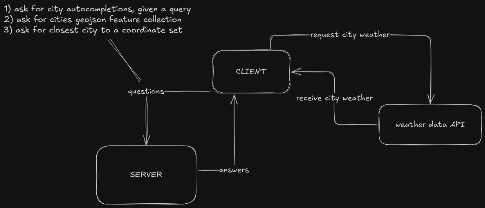

# Weather App

- Began: October 17th 21:55 CEST
- Ended: October 18th 00:35 CEST
- Total: 2h, 40min.

All changes (besides the initial commit) are merged via PRs. Branches are not deleted, so they can be checked out if desired.

Any commits after the above timestamp are either to this README file or to a `deploy` branch, if I decide that I want to deploy the app. Not sure yet.

---

### Acknowledgements

- I've previously used mapbox, so I have some exposure to it.
- I've never used openweathermap API.

----

### Initial Thoughts

Immediately after reading the description, I had the following ideas in mind:

1) When a user searches for a city, we should provide auto-suggestions of cities we guarantee are supported.
2) We should also show all supported cities in mapbox as clusters with clickable markers.
3) While the latter will be requested once, the former will be requested for each query keystroke.
4) Thus, we also need to ensure appropriate use of caching. 
5) My inclination is that using Cache-Control with gzip compression is probably fine for this assignment.

Now, in order to do that, we need to know about the cities we support, else we will not be able to provide auto-suggestions. We also want both the geojson and auto suggestions to be cacheable.

That means, I'm going to build a very simple server that can help us achieve that. Normally, of course that's not my job as a frontender but since I'm the only dev working on this assignment, I'll do it in order to achieve the functionality I desire. 

For that reason, the server is also in js, so I can save a build-step and focus on the frontend side of things.

I found this dataset that I'm going to use: https://simplemaps.com/data/world-cities

Once we have this, the admittedly very simple system will look as follows:

For the frontend, I'm going to use a 3rd party library for styling ([tailwindcss](https://tailwindcss.com/)) and components ([shadcn](https://ui.shadcn.com/)).

For this simple app, it's probably a bit too much, but it'll save some time, so I can finish all the features I want.

### Usage

##### Clone repo

- `git clone git@github.com:lindeneg/weathermap.git`

- `cd weathermap`

##### Ensure correct node version

- `nvm use`
*(nvm will pick up the version from .nvmrc in root folder)*

##### Install dependencies

- `npm i`

##### Set Environment

- `mv ./webapp/.example.env ./webapp/.env`

- Then fill out the required values.

##### Go back to the root project folder and run the below commands in two separate shells:

**Ensure you're running the correct node version in both shells.**

- `npm run start:server`

- `npm run start:webapp`

*(we could use a shell script, [concurrently](https://www.npmjs.com/package/concurrently) or docker to run the system in a single command but for now, I'm fine with this)*

### After Thoughts

Well, that was fun! Overall, I'm satisfied with the app after a few hours of intense coding.

---

I like the communication with a server we control, so we can ease calls to 3rd parties, do heavy caching etc. It feels very snappy even though the frontend keeps minimal data in its state.

One exception is the `geojson` that is fed to mapbox, it's 7MB (compressed it's 1.2MB, which is what we sent via http). Mapbox claim their studio app can handle 20MB, so a 7MB dataset is ok. However, one thing I wanted to explore but didn't get to, would be to stream geojson in chunks relative to the position and zoom of the map. Then we would only request the stuff when we need it but it could then feel less snappy.

------------

I'm happy with the frontend as is, but I kind of regret using shadcn. Not because I don't like it, it's absolutely awesome but rather because I ended up using too few components to actually justify it.

------------

I didn't get to any tests, which is quite bad I realize. I'd say I'm very passionate about tests and understand their importance and the pain it can cause in their absence. I simply didn't get to it and now it's midnight and I want to sleep. That is my bad for starting as late as I did, I just didn't have the time. Perhaps I'll push a few tests tomorrow though, so you can see how I write them.

